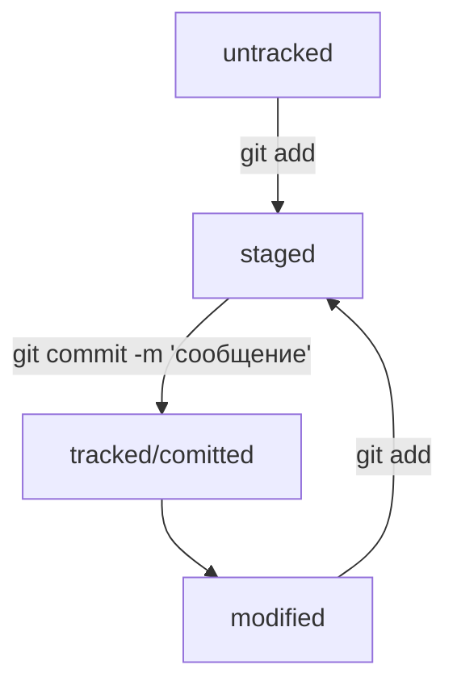
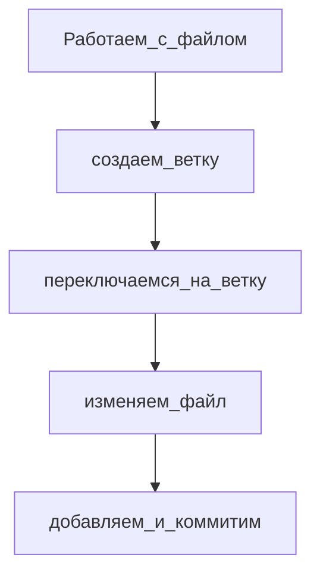

## Основные команды для работы в GIT
---

`pwd` - узнать в какой папке

`cd` - сменить директорию/папку

`cd /` - перейти в корневую директорию

`cd ..` - перейти на уровень выше

`cd ~` - перейти в домашнюю директорию

`cd ../../` - перейти на 2 уровня выше

`ls` - вывести содержиоме директории в которой находимся

`ls -a` - вывести расширенное содержимое со скрытыми файлами

`ls ~` - вывести содержимое домашней

`ls ..` - вывести содержимое родительской

`touch имя файла` - создать файл

`mkdir имя директории` - создать директорию

`mkdir -p dir1/dir2/dir3` - создать структуру директорий

`cp что куда` - копирование файлов

`mv что куда` - перемещение файлов (вырезка)

`cat` - чтение текстовых файлов (вывод содержимого файла на экран)

`rm` - удалить файл (без возможности восстановления)

`rmdir` - удалить пустую директорию (без возможности восстановления)

`rm -r` - удалить директорию со всем содержимым (без возможности восстановления)

`&&` - объединить сразу несколько команд

`стрелки вверх или вниз` - обратится к прошлым или следующим уже выполненным задачам

`Tab` - посмотреть список команд


`git version` - посмотреть версию установленой GIT

## Работа в команде
---

Для работы с командой нужно себя идентифицировать
```
git config --global user.name имя
git config --global user.email почта
```

## Работа с репозиторием
---

`git init` - создать из локальной папки локальный репозиторий

`rm -rf -git` - "разгитить" удалить репозиторий

`git status` - проверить состояние репозитория

`git status --ignore` - отобразит все игнорируемые файлы


`git add --all` - добавить все файлы в репозиторий

`git add .` - добавить всю текущую папку в репозиторий

`git add имя файла` - добавить файл в репозиторий


`git commit -m 'сообщение'` - сделать коммит (сохранить)  сообщением (описать что именно было изменено/создано). Сообщение не должно быть длинее 72 символов


`git log` - посмотреть историю коммитов от последнего к первому

`git log --oneline` - покажет первые несколько символов хеша каждого коммита + их комментарии

`HEAD` - синоним хеша последнего коммита, его можно указывать в качестве параметрав командах


**Посмотреть самый последний коммит**

```
pwd #нужно убедиться, что находимся в папке репозитория

cd .git/ #входим в скрытую папку

ls #убеждаемся что есть файл HEAD

cat HEAD #будет ссылка на последний коммит

cat ссылка из прошлого запроса #будет хеш последнего коммита
```


## Привязка удаленного репозитория к локальному
---

1. Создать на GitHub удаленный репозиторий
2. Перейти на его страницу и скопировать URL из SSH
3. Открыть консоль, перейти в каталог локального репозитория и набрать `git remote add имя репозитория URL (скопированный)`
4. Убедиться, что все работает `git remote -v`
5. `git push -u имя репозитория main/master` - загрузка содержимого с локального на удаленный в самый первый раз для этого репозитория
   
   `git push -u имя репозитория доп ветка в которой находимся и в которую добавляем`

   `git push` - следующие загрузки для этого же репозитория


## Основные статусы файлов GIT
---

1. untracked - неотслеживаемый (при создании в директории и без обновлении в консоли)
2. staged - подготовленный (в статусе changes to be committed - new file)
3. modified - измененный (changes not staged for commit)
4. tracked - отслеживаемый



После любых изменений делаем `git push`, что добавить в удаленный репозиторий


## Изменение последнего коммита
---

`git commit --amend --no-edit` - в последний коммит в последнем сохранении добавляется файл (который только сделали add а до этого забыли), но сообщение коммита остается прежним, и хеш коммита меняется

`git commit -amend -m 'Новое сообщение'` - все файлы преждние, но сообщение коммита меняется


## Откаты файлов
---

1. staged -> untracked (из подготовленного в неотслеживаемый)
	
	`git restore --staged имя файла`

	`git restore --staged` - сбросит всю текущую папку

2. откатить коммит (то есть уже сохраненное) tracked -> staged

	`git reset --hard хеш коммита`

3. откатить изменения внутри файла

	`git restore имя файла`


## Изменение файлов
---

Сравниваем последнюю закоммиченную версию файла с версией этого же файла в статусе изменения

`git diff` - посмотреть изменения вутри файла (до add)

`git diff --staged` - посмотреть изменения внутри файла (после add)

`git diff хеш нижнего хеш верхнего коммита` - посмотреть изменения конкретных двух коммитов

`git diff хеш нижнего коммита HEAD` - посмотреть изменения одного коммита и последнего

`echo ''` - выводит на консоль то что в ''

`echo '' >> файл` - запишет в конец файла то что в ''

`echo '' > файл` - перезапишет весь файл целеком на то что в ''


## Клонирование репозитория
---

Копирование удаленного чужого репозитория на локальный при открытом доступе и они будут синхронизированы, то есть можно будет в удаленный тот же вносить изменения

`git clone SSH ссылка из удаленного репозитория`

Далее нужно зайти в директорию скопированного и выполнить команду проверки связи `git remote -v`

Чтобы просто чужой удаленный репозиторий сохранить в свой акаунт GitHub нужно выполнить Fork  в удаленном акаунте

Во время клонирования, если веток не видно в локальном репозитории, необходимо внести их вручную с теми же названиями что и в удаленном `git checkout название ветки`


## Исполнить скрипт
---

`chmod +x имя файла скрипта.sh` - эта команда сделает файл иполняемым

`./имя файла скрипта.sh` - эта команда исполнит скрипт


## Ветки
---

Ветки - изолированный поток разработки проекта. Главная ветка main/master, остальные отходят от нее. В какой ветки коммитишь, в той ветке изменения и сохраняются, а в других остается все прежнее. Когда в консоли переходишь в определенную ветку в той редакции локально файл у тебя и откроется

`git branch` - посмотреть все ветки проекта

`git branch название ветки` - создание ветки

`git checkouy название ветки` - переключиться на другую ветки

`git checkout -b название ветки` - создать ветку и сразу на нее переключиться


В название ветки могут присутствовать: буквы, цифры, символы *, -, _, /

Работаем с файлом и если нужно начать работать в новой ветки, то:



**Сравниваем ветки**

`git diff 1ветка 2ветка` - разница между двумя ветками через название веток

`git diff 1ветка хеш коммита 2ветки` - разница между двумя ветками через последний хеш коммита ветки

`git diff ветка~4 ветка~` - разница между 4 коммитом с конца ветки и предыдущем коммите ветки

`git diff ветка~4 HEAD` - разница между 4 коммитом с конца ветки и последнем коммитом ветки


**Объединение и удаление веток**

`git merge название метки которую добавляем` - слияние веток. Переходим на ту ветку в которую вносим изменения с помощью объединяемой и там мержем

`git branch -D название метки` - удаляем ветку находясь в основной ветке

`git branch -d название метки` - безопасное удаление ветки, удалится только если есть полная копия

Удаление локальной ветки н удаляет ветку в GitHub


##Обновить с помощью удаленного
--

`git pull` - скачать последнюю версию со связанного удаленного репозитория


##Удаление конфликтов
--

1. вручную

2. с помощью консоли `git mergetool`. Откроется Vimdiff

3. с помощью Visual Studio Code